# SecureComm System Diagrams (Mermaid Code)

This file contains all the Mermaid diagram codes for the SecureComm project.
Copy these codes into any Mermaid-compatible editor (VS Code, GitHub, Notion, etc.) to render the diagrams.

---

## 1. High-Level System Architecture

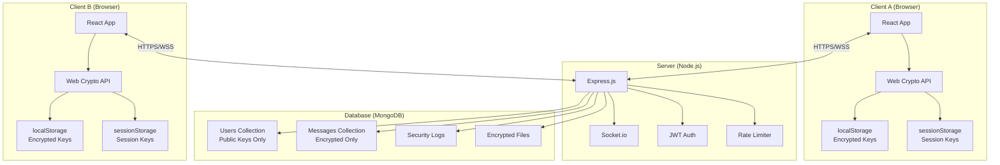

---

## 2. Key Exchange Protocol Flow

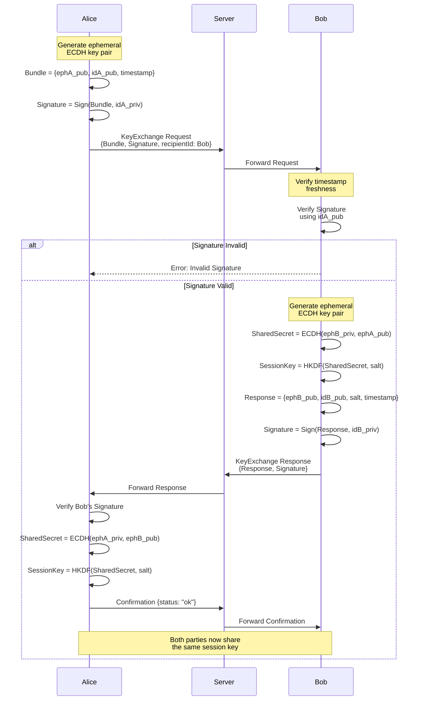

---

## 3. Message Encryption Flow

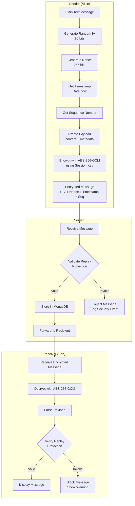

---

## 4. Replay Attack Protection Layers

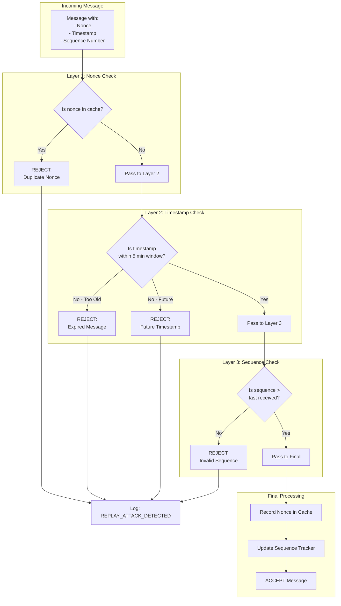

---

## 5. MITM Attack Prevention

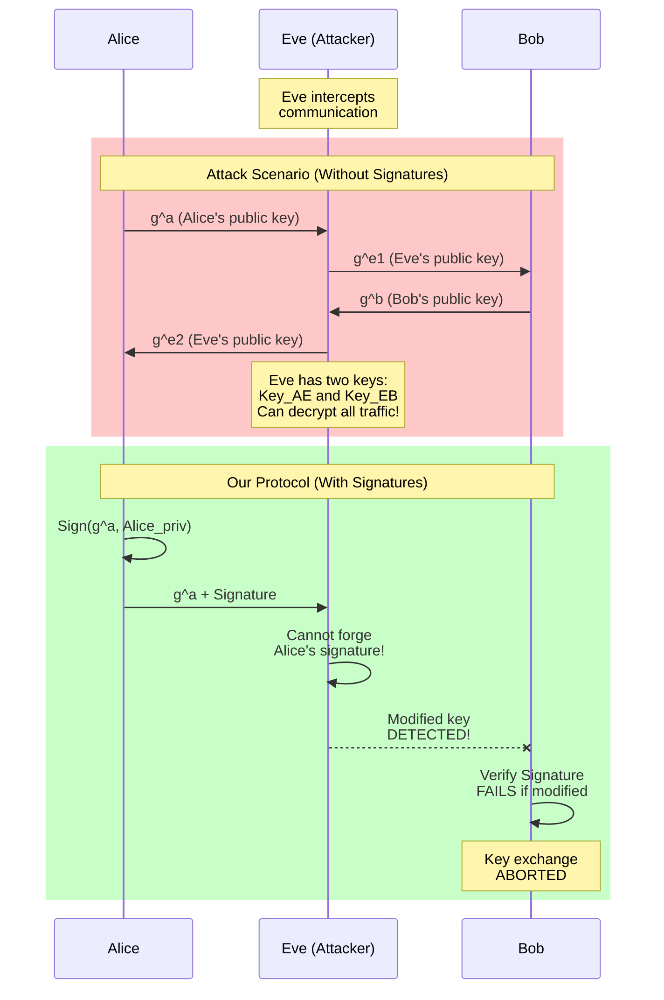

---

## 6. User Registration Flow

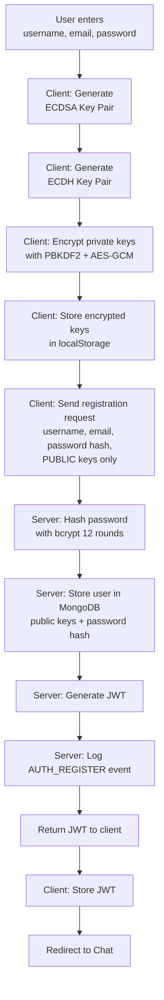

---

## 7. File Encryption Flow

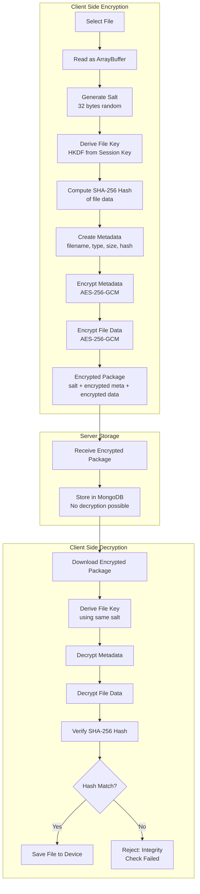

---

## 8. STRIDE Threat Model

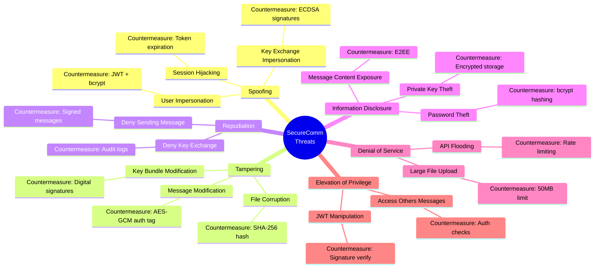

---

## 9. Database Schema

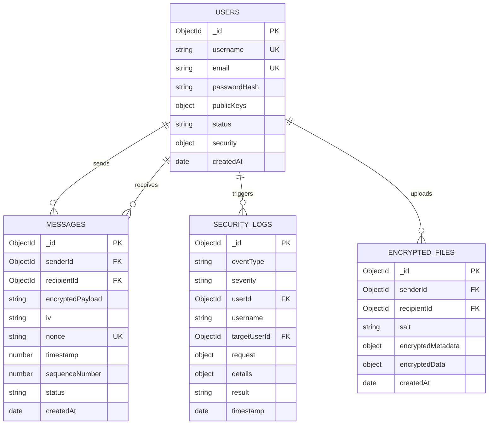

---

## 10. Authentication Flow

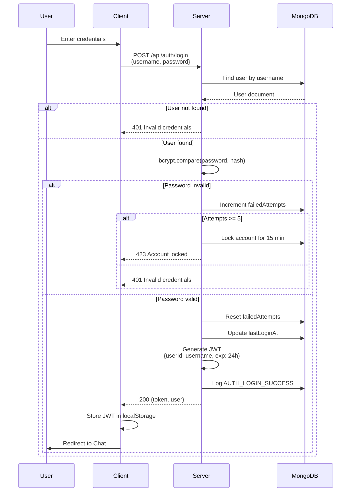

---

## 11. Session Key Derivation

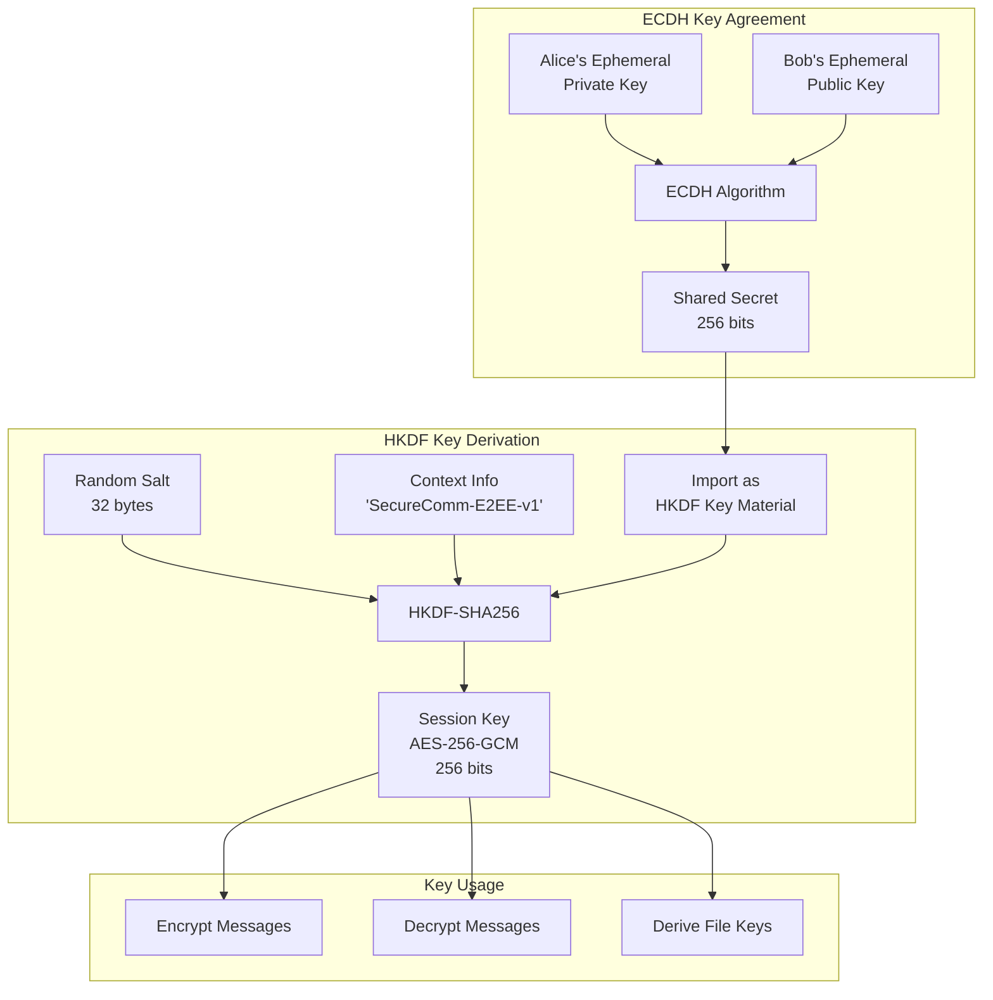

---

## 12. Complete Message Flow

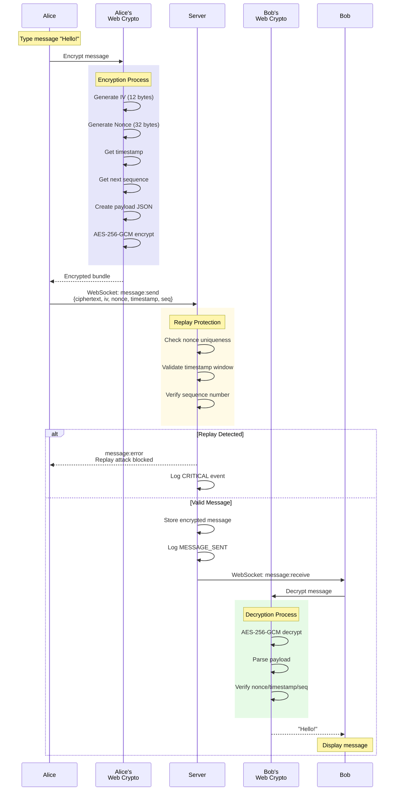

---

## How to Use These Diagrams

### Option 1: VS Code with Mermaid Extension
1. Install "Markdown Preview Mermaid Support" extension
2. Open this file in VS Code
3. Press `Ctrl+Shift+V` to preview

### Option 2: GitHub/GitLab
- Simply push this file to your repository
- GitHub/GitLab will automatically render the diagrams

### Option 3: Mermaid Live Editor
1. Go to https://mermaid.live
2. Paste any diagram code
3. Export as PNG/SVG

### Option 4: Notion
1. Create a new code block
2. Select "Mermaid" as the language
3. Paste the diagram code

### Option 5: Draw.io/diagrams.net
1. Insert → Advanced → Mermaid
2. Paste the code

---

*Diagrams created for SecureComm E2EE Messaging System*  
*December 2024*
